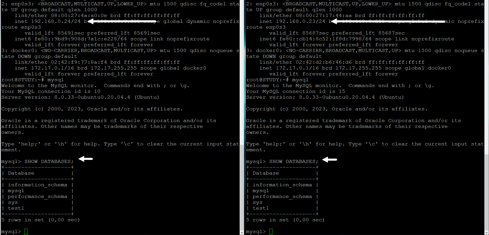

# Домашнее задание к занятию 12.6. «Репликация и масштабирование. Часть 1»

### Инструкция по выполнению домашнего задания

1. Сделайте fork [репозитория c шаблоном решения](https://github.com/netology-code/sys-pattern-homework) к себе в Github и переименуйте его по названию или номеру занятия, например, https://github.com/имя-вашего-репозитория/gitlab-hw или https://github.com/имя-вашего-репозитория/8-03-hw).
2. Выполните клонирование этого репозитория к себе на ПК с помощью команды `git clone`.
3. Выполните домашнее задание и заполните у себя локально этот файл README.md:
   - впишите вверху название занятия и ваши фамилию и имя;
   - в каждом задании добавьте решение в требуемом виде: текст/код/скриншоты/ссылка;
   - для корректного добавления скриншотов воспользуйтесь инструкцией [«Как вставить скриншот в шаблон с решением»](https://github.com/netology-code/sys-pattern-homework/blob/main/screen-instruction.md);
   - при оформлении используйте возможности языка разметки md. Коротко об этом можно посмотреть в [инструкции по MarkDown](https://github.com/netology-code/sys-pattern-homework/blob/main/md-instruction.md).
4. После завершения работы над домашним заданием сделайте коммит (`git commit -m "comment"`) и отправьте его на Github (`git push origin`).
5. Для проверки домашнего задания преподавателем в личном кабинете прикрепите и отправьте ссылку на решение в виде md-файла в вашем Github.
6. Любые вопросы задавайте в чате учебной группы и/или в разделе «Вопросы по заданию» в личном кабинете.

Желаем успехов в выполнении домашнего задания.

---

### Задание 1

На лекции рассматривались режимы репликации master-slave, master-master, опишите их различия.

*Ответить в свободной форме.*

Репликация master-slave это вид репликации при котором несколько серверов (slave) подключаются к одному (master) и начинают реплицировать его данные. (Репликация происходит по умолчанию в режиме mixed. Т.к. раньше было 2 типа репликации 1-е по командный и построчный. Но т.к. по отдельности первый способ давал расхождения при первом же "RANDOM", а второй не всегда эффективно использовать - их объединили в режим mixed который эффективно использует первый и второй способы когда это нужно.) Основная работа происходит на master, а slave реплицируют с него данные. Если вдруг откажет один из slaveов то ничего страшного не произойдёт, по восстановлению slave подключится к masterу и возможно часть данных станет доступна только для чтения, но это все равно лучше чем репликация master-master.

Репликация master-master... Возможно она даёт некоторый прирост производительности но... Все её преимущества меркнут после первого же лага соединения между серверами. Т.к. оба сервера являются мастерами, то может возникнуть такая ситуация, когда из-за лага создались данные которые используют 1 и тот же уникальный ID и непонятно кто неправ. Повезло если вся эта история не поехала дальше. Но если произошёл лаг и заметили это спустя долгое время - может возникнуть очень серьёзный инцедент который принесет большие потери бизнесу.

---

### Задание 2

Выполните конфигурацию master-slave репликации, примером можно пользоваться из лекции.

*Приложите скриншоты конфигурации, выполнения работы: состояния и режимы работы серверов.*

---

## Дополнительные задания (со звёздочкой*)
Эти задания дополнительные, то есть не обязательные к выполнению, и никак не повлияют на получение вами зачёта по этому домашнему заданию. Вы можете их выполнить, если хотите глубже шире разобраться в материале.

---
при
### Задание 3* 

Выполните конфигурацию master-master репликации. Произведите проверку.

*Приложите скриншоты конфигурации, выполнения работы: состояния и режимы работы серверов.*
